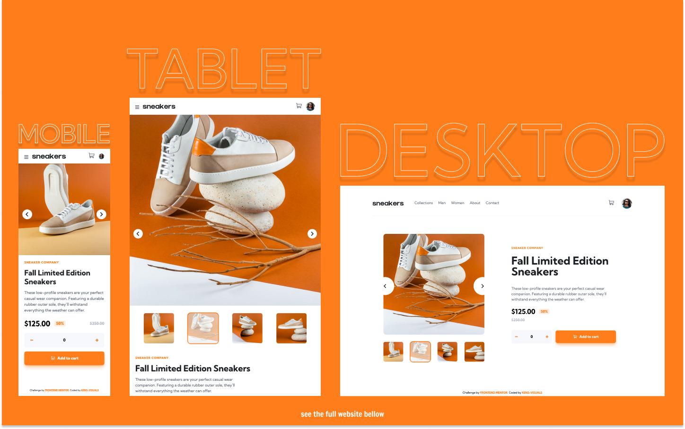

# Frontend Mentor - E-Commerce Product Page Solution

This is a solution to the [E-Commerce Product Page Challenge on Frontend Mentor](https://www.frontendmentor.io/challenges/ecommerce-product-page-UPsZ9MJp6).

## Table of contents

- [Overview](#overview)
  - [The challenge](#the-challenge)
  - [Screenshot](#screenshot)
  - [Links](#links)
- [My process](#my-process)
  - [Built with](#built-with)
  - [What I learned](#what-i-learned)
  - [Useful resources](#useful-resources)
- [Author's Links](#authors-links)

## Overview

### The challenge

Users should be able to:

- View the optimal layout for the site depending on their device's screen size
- See hover states for all interactive elements on the page
- Switch the large product image by clicking on the small thumbnail images
- Add items to the cart
- View the cart and remove items from it

### Screenshot

### Links

- Live Site URL: [https://kens-visuals.github.io/ecommerce-product-page/](https://kens-visuals.github.io/ecommerce-product-page/)
- Solution URL: [TO_BE_UPDATED](TO_BE_UPDATED)

## My process

### Built with

- React
- Tailwind CSS
- Semantic HTML5 markup
- CSS Flexbox
- CSS Grid
- Mobile-first workflow

### What I learned

This was my first Intermediate project, and I'm really excited about the stack that I used. It wasn't a really big project, but it was big enough for Tailwind CSS. I used Tailwind CSS before in a small project, however, this time around it was a completely different experience. Although, I like Tailwind CSS a lot, I don't think one can use it in each and every project. Sometimes, I want to take the control in my hands, and in that case styled-components come to help. In brief, a cool project, that helped me to know Tailwind better and decide in what type of project I'd like to use it in the future.

### Useful resources

- [My image slider](https://codesandbox.io/embed/nice-snyder-h46gsi?fontsize=14&hidenavigation=1&theme=dark) - Before beginning this project, I just wanted to make a simple slider in React and plain CSS for some practice. So, if you need a reference, here's one.

## Author's Links

- Medium - [@kens_visuals](https://medium.com/@kens_visuals)
- CodePen - [@kens-visuals](https://codepen.io/kens-visuals)
- Codewars - [@kens_visuals](https://www.codewars.com/users/kens_visuals)
- Frontend Mentor - [@kens-visuals](https://www.frontendmentor.io/profile/kens-visuals)
